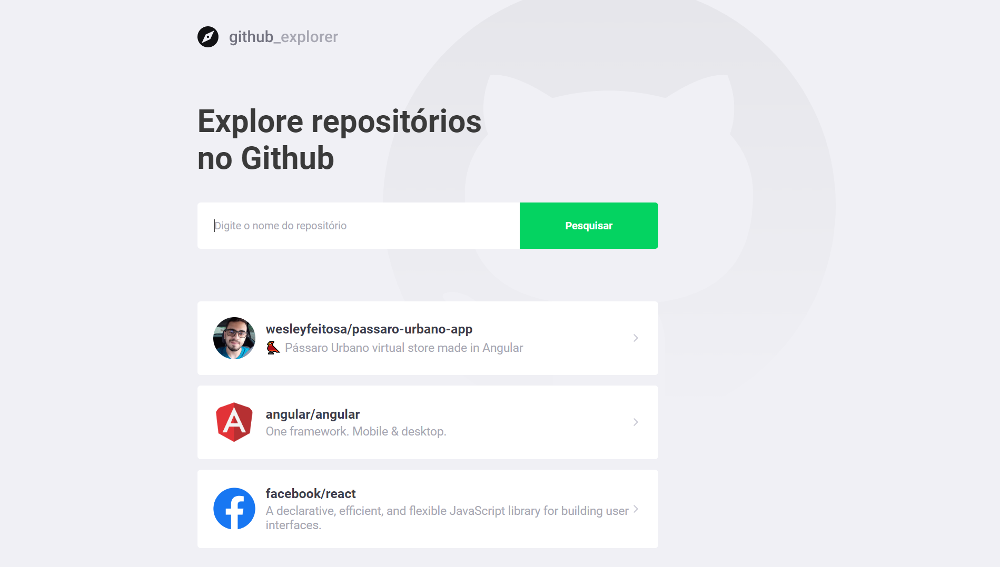
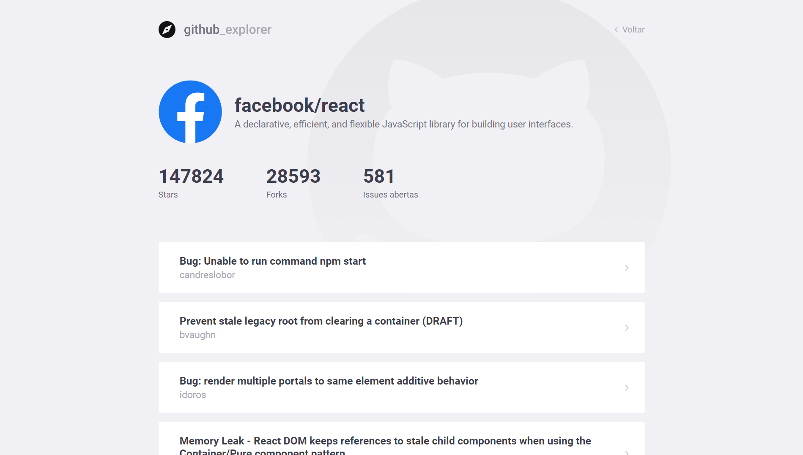

<br />
<p align="center">
    
</p>
<br />

<p align="center">

  <a href="LICENSE" style="text-decoration: none">
    
  </a>

  <a href="https://github.com/wesleyfeitosa/github-explorer/issues" style="text-decoration: none">
    
  </a>

  <a href="https://github.com/wesleyfeitosa/github-explorer/stargazers" style="text-decoration: none">
    
  </a>

  <a href="#" style="text-decoration: none">
    
  </a>

</p>

---

## :rocket: Technologies

This project was developed with the following technologies:

- [Node.js](https://nodejs.org/en/)
- [TypeScript](https://www.typescriptlang.org/)
- [React](https://reactjs.org)
- [Styled Components](https://styled-components.com/)

## 💻 Project

This application brings a new way to browse the github api, information about repositories, issues, stars, followers all presented through a modern and clean layout.




## :hammer: Deploy

- Frontend: https://github-explorer.wesleyfeitosa.com.br/

## 🤔 How to contribute

- Fork this repository;
- Create a branch with your feature: `git checkout -b minha-feature`;
- Commit your changes: `git commit -m 'feat: Minha nova feature'`;
- Push to your branch: `git push origin minha-feature`.

After the merge of your pull request is done, you can delete your branch.

## 🔖 How to run

#### Cloning the project
```sh
git clone https://github.com/wesleyfeitosa/github-explorer.git
cd github-explorer
npm install
```
#### Starting Frontend
```sh
cd frontend
npm start
```

## :memo: License

This project is under the MIT license. See the file [LICENSE](LICENSE) for more details.

---

Made with 💜 by Wesley Feitosa :wave:
